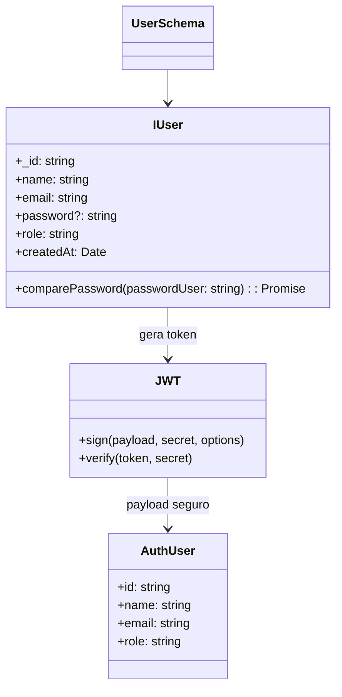

# Sistema de Gestão de Pontos - Conta Certa

Este projeto é um backend simples de gerenciamento de ponto de trabalho utilizando Next.js, MongoDB e JWT para autenticação.

---

## Tecnologias

- Next.js (API Routes)
- MongoDB + Mongoose
- JWT (jsonwebtoken)
- bcrypt para hash de senhas
- TypeScript

---

## Funcionalidades

- Cadastro de usuários
- Login e geração de token JWT
- Middleware de autenticação
- Controle de permissões por role (USER / ADMIN)
- Proteção de rotas

---

## Variáveis de Ambiente

```env
MONGODB_URI=<connection-string>
JWT_SECRET=<chave-secreta>
```

## Endpoints

### POST /api/users
Cria um novo usuário.

**Body:**
```json
{
  "name": "João",
  "email": "joao@email.com",
  "password": "123456",
  "role": "USER"
}
```

**Resposta:**
```json
{
  "success": true,
  "token": "<JWT_TOKEN>",
  "usuario": {
    "id": "<USER_ID>",
    "email": "joao@email.com",
    "name": "João",
    "role": "USER"
  }
}
```
### POST /api/users
Cria um novo usuário.

**Body:**
```json
{
  "name": "João",
  "email": "joao@email.com",
  "password": "123456",
  "role": "USER"
}
```
**Resposta:**
```json
{
  "success": true,
  "token": "<JWT_TOKEN>",
  "usuario": {
    "id": "<USER_ID>",
    "email": "joao@email.com",
    "name": "João",
    "role": "USER"
  }
}
```
### POST /api/login

Faz login e retorna token JWT.

**Body:**
```json
{
  "email": "joao@email.com",
  "password": "123456"
}
```

**Resposta:**
```json
{
  "success": true,
  "token": "<JWT_TOKEN>",
  "usuario": {
    "id": "<USER_ID>",
    "email": "joao@email.com",
    "name": "João",
    "role": "USER"
  }
}
```

## Autenticação

- Todas as requisições protegidas devem enviar o token JWT no header:

- O middleware `verifyToken` valida o token e extrai os dados do usuário.
- Somente usuários autenticados podem acessar rotas protegidas.
- Roles podem ser usadas para controlar acesso (ex.: apenas ADMIN pode acessar `/admin`).

## Diagrama de Classes (Mermaid)



## Fluxo de Autenticação (Mermaid)

```mermaid
flowchart TD
    A[Usuário envia login (email + senha)] --> B{Autenticar usuário?}
    B -- Não --> C[Retorna erro 401]
    B -- Sim --> D[Gerar token JWT com AuthUser]
    D --> E[Retornar token + dados do usuário]
    E --> F[Frontend armazena token]
    F --> G[Requisições subsequentes com Authorization: Bearer <token>]
    G --> H[Middleware verifica token]
    H --> I{Token válido?}
    I -- Não --> J[Retorna erro 401]
    I -- Sim --> K[Requisição continua para a rota protegida]
```